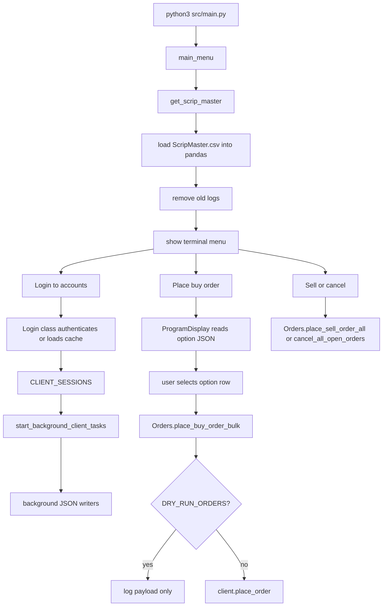
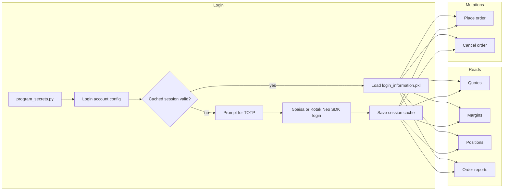
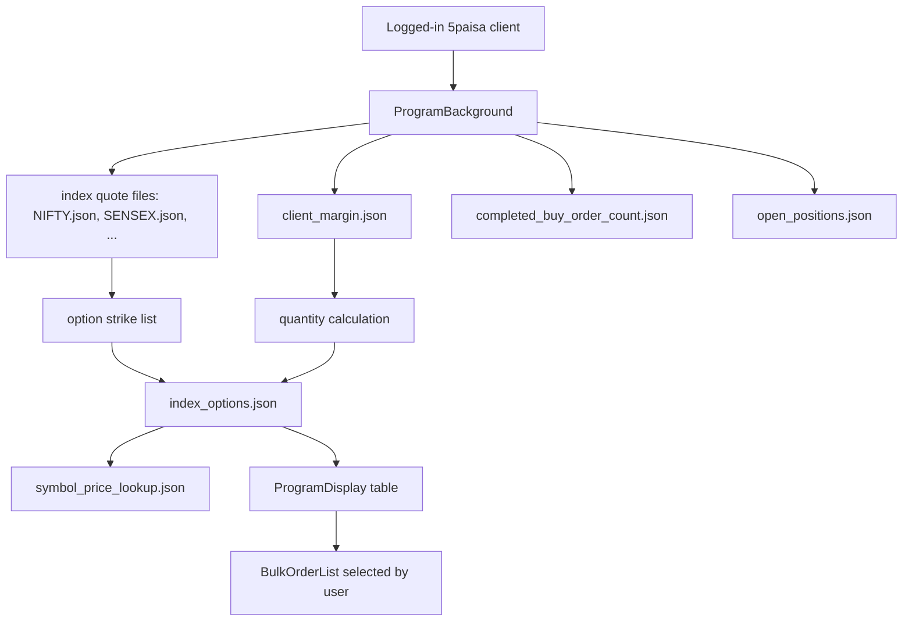
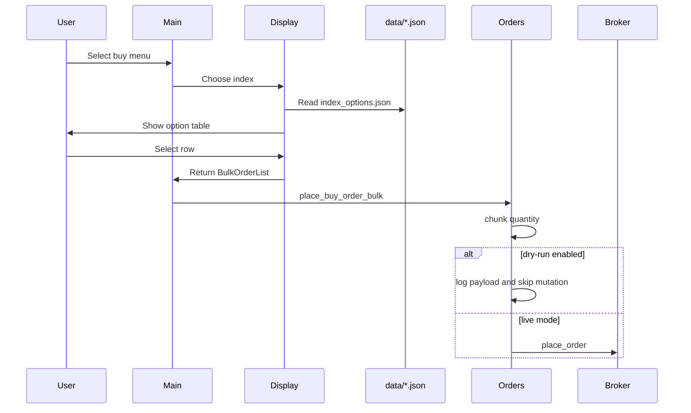

# Trade Ops CLI

A terminal trading assistant for building option order payloads from live quote data, logging in to 5paisa and Kotak Neo accounts, maintaining local JSON snapshots in the background, and placing/cancelling orders from a menu-driven workflow.

This README documents the current working shape of the codebase after the safety and reliability cleanup work. It is intentionally operational: how the script starts, what files it reads/writes, where broker calls happen, how dry-run mode works, and how to verify changes before trusting them.

## Current Scope

The current goal is stability first: keep the existing UI and user workflow intact while making the engine safer, faster to test, and easier to refactor.

In scope now:

- Login/session handling for configured 5paisa and Kotak Neo accounts.
- Local quote, margin, position, option-chain, and order lookup files under `data/`.
- Menu-driven buy/sell/cancel workflows.
- Dry-run safety mode for order placement and cancellation.
- Unit tests that mock broker SDKs and avoid live logins/trades.
- Syntax, formatting, testability, and reliability refactors that preserve behavior.

## Broker Design Rationale

This project intentionally uses two broker integrations for different jobs:

| Broker | Used for | Why |
|---|---|---|
| 5paisa | Quote-heavy workflows: scrip master download, index/option quote snapshots, option-chain JSON files, and display-table data. | In this workflow, the 5paisa API has been reliable for quote reads and tends not to break down often during quote polling. |
| Kotak Neo | Trade execution: buy orders, exit orders, and open-order cancellation. | Kotak Neo API trades are treated as the execution path because API trades are zero brokerage for this setup. |

The result is a split engine: 5paisa feeds the local quote/order-building surface, while Kotak Neo handles the mutating order calls.

Not in scope yet:

- Changing the terminal UI flow.
- Changing the credential layout.
- Replacing the broker SDKs.
- Introducing a new GUI.
- Placing real trades from tests.

## Safety Notes

This project can place and cancel real orders when dry-run mode is not enabled.

Before testing menu flows, prefer:

```bash
TRADING_PROGRAM_DRY_RUN_ORDERS=1 python3 src/main.py
```

Dry-run mode skips mutating broker calls:

- `place_order`
- `cancel_order`
- `cancel_bulk_order`

Dry-run mode still allows read-only calls such as quotes, positions, margins, order books, and order reports so that the program can build the same payloads it would build in live mode.

The default is live mode because preserving existing behavior was the refactor rule. That means this command can place/cancel real orders after login:

```bash
python3 src/main.py
```

## Prerequisites

You need the following before live use:

- Python 3.11.
- A 5paisa account with API access enabled for quote/scrip-master reads.
- A Kotak Neo account with API access enabled for order placement/cancellation.
- Broker API credentials filled locally in `src/program_secrets.py`.
- TOTP/authenticator access for each configured broker account.
- A clear understanding that normal mode can place and cancel real orders.

For development and portfolio review, the unit tests do not require live broker access because broker SDK calls are mocked.

## Quick Start

Install the locked safe dependency set:

```bash
pipenv install
```

For live Kotak Neo trading, install Kotak's SDK code without its pinned dependencies:

```bash
pipenv run python -m pip install --no-deps "git+https://github.com/Kotak-Neo/Kotak-neo-api-v2.git@1533903cb5db1a50892223b404d753dbc8fba50e#egg=neo-api-client"
```

Why the extra command? The upstream Kotak SDK currently pins older transitive packages exactly. This project keeps patched versions of `requests`, `urllib3`, `certifi`, `idna`, `PyJWT`, `python-dotenv`, and `websockets` in the lockfile, then loads the Kotak SDK lazily only when a Kotak login is attempted. Unit tests and quote-only development do not need the Kotak SDK installed.

Create your local secrets file from the redacted template:

```bash
cp src/program_secrets.example.py src/program_secrets.py
```

Then fill `src/program_secrets.py` locally. The real file is ignored and must not be committed.

Enter the virtual environment:

```bash
pipenv shell
```

Run in dry-run mode:

```bash
TRADING_PROGRAM_DRY_RUN_ORDERS=1 python3 src/main.py
```

Run in normal/live mode:

```bash
python3 src/main.py
```

Run all tests:

```bash
python3 -m unittest discover -v
```

Run Ruff if it is on your `PATH`:

```bash
ruff check --no-cache src tests
ruff format --check src tests
```

Compile-check Python files:

```bash
python3 -m compileall -q src tests
```

## Project Layout

```text
trading_program_v2/
|-- data/
|   |-- ScripMaster.csv
|   `-- <account_key>/
|       |-- <INDEX>.json
|       |-- <INDEX>_options.json
|       |-- client_margin.json
|       |-- completed_buy_order_count.json
|       |-- open_positions.json
|       |-- symbol_price_lookup.json
|       `-- login_information.pkl
|-- docs/
|   `-- refactor_test_plan.md
|-- logs/
|   |-- primary_program_runner/
|   |-- program_background/
|   |-- program_display/
|   |-- program_login/
|   |-- program_orders/
|   `-- program_quotes/
|-- src/
|   |-- main.py
|   |-- program_background.py
|   |-- program_client_profile.py
|   |-- program_constants.py
|   |-- program_display.py
|   |-- program_helpers.py
|   |-- program_login.py
|   |-- program_orders.py
|   |-- program_quotes.py
|   |-- program_secrets.example.py
|   `-- program_secrets.py        # local only, ignored
|-- tests/
|   |-- test_display_background.py
|   |-- test_helpers.py
|   |-- test_login.py
|   |-- test_main_and_constants.py
|   |-- test_orders.py
|   `-- test_quotes_profile.py
|-- Pipfile
|-- Pipfile.lock
|-- requirements.txt
|-- ruff.toml
`-- README.md
```

## Module Walkthrough

| File | Responsibility |
|---|---|
| `src/main.py` | Entry point. Starts the menu, downloads/loads the scrip master, logs in accounts, starts background workers, and routes menu choices to display/order modules. |
| `src/program_constants.py` | Central constants: data/log paths, index metadata, expiry days, lot sizes, 2026 holiday list, dry-run environment flag, market timings. |
| `src/program_secrets.example.py` | Redacted GitHub-safe template for local broker credentials. |
| `src/program_secrets.py` | Local account credentials and API configuration. Ignored by Git; keep this private. |
| `src/program_login.py` | Broker login/session cache layer for 5paisa and Kotak Neo. Handles TOTP prompts, pickle caching, corrupt cache cleanup, and CA bundle setup. |
| `src/program_background.py` | Background data writer. Periodically writes quotes, option chains, margin, open positions, completed buy counts, and symbol price lookup files. |
| `src/program_quotes.py` | Quote and expiry helper. Gets index LTP, option LTPs, strike lists, current expiry, holiday-shifted expiry dates. |
| `src/program_client_profile.py` | Margin and completed-order count logic. Applies buffer margin before calculating purchasable quantities. |
| `src/program_display.py` | Terminal table/menu layer. Reads generated JSON files and turns selected rows into bulk order payload lists. |
| `src/program_orders.py` | Order engine. Chunks buy/sell quantities, places Kotak Neo order payloads, cancels open orders, supports dry-run mode. |
| `src/program_helpers.py` | Shared helpers: logging, CA bundle detection, atomic JSON read/write, thread launcher, scrip master download, signal handling, log cleanup. |
| `tests/` | Offline unit tests. Broker SDKs and network/order calls are mocked. |

## Runtime Flow



## Broker Interaction Flow



## Data Generation Flow



## Current Account Routing

The menu says "all logged in accounts", but the current implementation has a hard routing choice in `src/main.py`:

- `KOTAK_PRIMARY_ACCOUNT = "ACCOUNT_KOTAK_NEO_PRIMARY"`
- Buy orders are routed through the Kotak primary account.
- Sell and cancel are also run only for the Kotak primary account.
- The 5paisa account is still important because quote and option-chain files are generated from the 5paisa-side data directory used by the display.

This is documented as current behavior, not necessarily final design. The split is deliberate: 5paisa is the quote/data side, and Kotak Neo is the zero-brokerage execution side.

## Main Menu

When the program starts, it displays:

```text
1. Login to accounts
2. Place buy order for all logged in accounts
3. Place sell order for all logged in accounts
4. Place cancel order for all logged in accounts
5. Logout of accounts
6. See which accounts are logged in
7. Debug
8. Flip delivery flag for all clients
9. Remove all session files for all clients
10. Change option chain depth
11. Exit program
```

Important menu notes:

- Option `1` logs in selected accounts and starts background tasks.
- Option `2` reads generated option JSON files, shows the option table, and places buy payloads for the selected row.
- Option `3` places sell orders and then cancels open orders.
- Option `4` cancels open orders.
- Option `8` flips `INTRADAY` between `MIS` and `NRML`.
- Option `9` deletes cached `login_information.pkl` session files.
- Option `10` changes the runtime variable in `main.py`; it does not currently update `src/program_constants.py`.

## Login and Sessions

Session files live here:

```text
data/<account_key>/login_information.pkl
```

The login layer:

- Uses cached sessions if they are recent enough.
- Deletes corrupt or empty pickle files and re-authenticates.
- Uses atomic pickle writes for safer session cache updates.
- Special-cases 5paisa because its client can contain an unpicklable `httpx.Client`.
- Rebuilds the 5paisa HTTP session wrapper when loading a cached client.
- Configures CA bundle environment variables before broker calls.

If SSL fails because your network/VPN injects a corporate/self-signed certificate chain, set a trusted CA bundle:

```bash
KOTAK_REQUESTS_CA_BUNDLE=/path/to/corp-ca.pem python3 src/main.py
```

or:

```bash
FIVEPAISA_REQUESTS_CA_BUNDLE=/path/to/corp-ca.pem python3 src/main.py
```

The helper also sets `REQUESTS_CA_BUNDLE` and `SSL_CERT_FILE` when it finds a valid bundle path.

## Expiry and Symbol Logic

Expiry selection uses:

- Index weekly expiry day from `INDEX_DETAILS_FNO`.
- `HOLIDAY_LIST` from `src/program_constants.py`.
- Left shift when the normal expiry date is a holiday.
- Roll-forward after the current week's expiry has passed.

Examples covered by tests:

- NIFTY expiry on Tuesday, October 20, 2026 shifts to Monday, October 19, 2026 because October 20 is in the holiday list.
- SENSEX expiry on Thursday, May 28, 2026 shifts to Wednesday, May 27, 2026.
- If trading on Friday, May 29, 2026, the program selects the next week's expiry because that week's expiries have passed.

Kotak option symbol transformation currently follows this rule:

- Before the last expiry week of the month: use `YY + month-code + DD + strike + CE/PE`.
- In the last expiry week of the month: use `YY + MMM + strike + CE/PE`.

Examples:

```text
NIFTY 19 May 2026 CE 23400.00 -> NIFTY2651923400CE
NIFTY 26 May 2026 CE 23400.00 -> NIFTY26MAY23400CE
NIFTY 19 Oct 2026 CE 25000.00 -> NIFTY26O1925000CE
```

## Order Flow



Buy order behavior:

- Takes the selected `BulkOrderList`.
- Removes display-only fields such as `index` and `tag`.
- Applies `MIS` or `NRML` based on the runtime delivery flag.
- Chunks large quantities based on lot size and maximum order size.
- Runs placement in background threads.
- Sleeps briefly after every 10 chunks to avoid hammering the broker API.

Sell order behavior:

- Reads open positions.
- Skips `NRML` positions.
- Gets live LTP from Kotak positions for exit pricing.
- Places IOC-style limit sell or buy-cover orders depending on net quantity.

Cancel behavior:

- For Kotak Neo, reads `order_report()` and cancels open orders by order number.
- For 5paisa-style clients, reads `order_book()` and sends `cancel_bulk_order`.
- Dry-run skips actual cancellation calls.

## Dry-Run Mode

Enable with either environment variable:

```bash
TRADING_PROGRAM_DRY_RUN_ORDERS=1 python3 src/main.py
```

or:

```bash
TRADING_PROGRAM_DRY_RUN=1 python3 src/main.py
```

Truthy values are:

```text
1, true, yes, y, on
```

Dry-run mode is implemented in:

- `src/program_constants.py` as `DRY_RUN_ORDERS`
- `src/program_orders.py` through `_place_order`, `_cancel_order`, and `_cancel_bulk_order`

## Local Files Written at Runtime

| File | Writer | Purpose |
|---|---|---|
| `data/ScripMaster.csv` | `get_scrip_master()` | Master scrip code file downloaded from 5paisa. |
| `data/<account>/login_information.pkl` | `Login` | Cached broker session. |
| `data/<account>/<INDEX>.json` | `ProgramBackground.store_index_quotes_to_file` | Latest index quote and current expiry. |
| `data/<account>/<INDEX>_options.json` | `ProgramBackground.store_index_option_quotes_to_file` | Option rows, prices, quantities, and bulk order payloads. |
| `data/<account>/client_margin.json` | `ProgramBackground.store_client_margin_to_file` | Available margin after buffer. |
| `data/<account>/completed_buy_order_count.json` | `ProgramBackground.store_completed_buy_order_count_to_file` | Count of completed buy orders. |
| `data/<account>/open_positions.json` | `ProgramBackground.store_client_open_positions_to_file` | Open positions snapshot. |
| `data/<account>/symbol_price_lookup.json` | `ProgramBackground.store_symbol_price_lookup_to_file` | Merged symbol to price/index lookup. |

JSON writes are now atomic:

- A unique temp file is written in the same directory.
- The file is flushed and fsynced.
- `os.replace` swaps it into place.
- Failed writes clean up temp files.

JSON reads now tolerate invalid/partial JSON by returning `None`, allowing background loops and display code to retry instead of crashing on a half-written or cloud-sync-interrupted file.

## Testing

Run the whole suite:

```bash
python3 -m unittest discover -v
```

Focused suites:

```bash
python3 -m unittest tests.test_helpers -v
python3 -m unittest tests.test_login -v
python3 -m unittest tests.test_orders -v
python3 -m unittest tests.test_quotes_profile -v
python3 -m unittest tests.test_display_background -v
python3 -m unittest tests.test_main_and_constants -v
```

Verification gate used after each refactor:

```bash
python3 -m unittest discover -v
ruff check --no-cache src tests
ruff format --check src tests
python3 -m compileall -q src tests
```

Current test coverage includes:

- Login cache behavior.
- Corrupt/empty session file cleanup.
- SSL error detection.
- CA bundle configuration.
- 5paisa session pickle/rebuild behavior.
- Quote payload building.
- Expiry date selection and holiday left-shift behavior.
- May 2026 and October 2026 expiry edge cases.
- Symbol transformation for weekly and last-week/monthly formats.
- Margin and completed-order count logic.
- Background file writer behavior.
- Display table and bulk-order extraction.
- Buy/sell/cancel order chunking.
- Dry-run mode preventing mutating broker calls.
- Main menu orchestration with mocked user inputs.

Tests do not perform real broker logins, place real orders, cancel real orders, or require live market data.

## Refactor Workflow

The current refactor plan is documented in:

```text
docs/refactor_test_plan.md
```

The rule for each change:

1. Run the focused test path before touching the file.
2. Make the smallest behavior-preserving change.
3. Run the same focused test path immediately after.
4. Run the global verification gate.
5. Move to the next change only after the gate passes.

A backup snapshot was created before engine refactors:

```text
backups/pre_engine_refactor_2026-05-14_1009/
```

## Recent Reliability Changes

| Area | Change | Why it matters |
|---|---|---|
| Order safety | Added `TRADING_PROGRAM_DRY_RUN_ORDERS` and `TRADING_PROGRAM_DRY_RUN`. | Lets you exercise the program without placing or cancelling real orders. |
| Order API calls | Wrapped mutating calls in `_place_order`, `_cancel_order`, and `_cancel_bulk_order`. | One control point for live vs dry-run behavior. |
| JSON writes | Switched to unique temp files plus atomic replace. | Safer with multiple background writers and synced folders. |
| JSON reads | Invalid JSON returns `None`. | A partial/stale file no longer crashes the reader path. |
| Background threads | Threads are named and uncaught target errors are logged. | Easier debugging when a background worker dies. |
| SSL/CA setup | Added CA bundle detection and broker-specific override env vars. | Helps with self-signed/corporate/VPN certificate chains. |
| Dependency hygiene | Removed the hard Kotak SDK lock dependency and pinned patched network/auth packages. | Keeps the public dependency graph clean while preserving live Kotak support through an explicit optional SDK install. |
| Expiry logic | Added 2026 NSE F&O holiday list and expiry left-shift tests. | Prevents using holiday expiry dates. |
| Symbol logic | Weekly vs last-week symbol transform covered by tests. | Protects Kotak symbol formatting around monthly expiry. |

## Common Commands

Remove cached sessions from inside the app:

```text
Main Menu -> 9. Remove all session files for all clients
```

Manually remove a single cached session:

```bash
rm data/<account_key>/login_information.pkl
```

Run with Kotak CA override:

```bash
KOTAK_REQUESTS_CA_BUNDLE=/path/to/corp-ca.pem python3 src/main.py
```

Run with 5paisa CA override:

```bash
FIVEPAISA_REQUESTS_CA_BUNDLE=/path/to/corp-ca.pem python3 src/main.py
```

Run with dry-run and CA override together:

```bash
TRADING_PROGRAM_DRY_RUN_ORDERS=1 KOTAK_REQUESTS_CA_BUNDLE=/path/to/corp-ca.pem python3 src/main.py
```

## GitHub Safety

The repository is prepared so these local/runtime files stay out of GitHub:

- `src/program_secrets.py` and any `src/program_secrets*.py` local copies.
- `data/`, including broker session pickle files and downloaded scrip master CSVs.
- `logs/`, `backups/`, `__pycache__/`, `.env*`, `*.pkl`, and `*.pickle`.

Only `src/program_secrets.example.py` should be committed as the credential template. Before publishing, run:

```bash
git status --short
git ls-files -ci --exclude-standard
git ls-files -o --exclude-standard
```

The first command shows pending changes. The second should not list ignored tracked secrets. The third shows untracked files that are not ignored and may be added.

## Known Sharp Edges

- `src/program_secrets.py` contains private account data and should stay local.
- The Debug menu uses `eval` on commands starting with `client.`. Treat it as trusted-local-only.
- The menu text says "all logged in accounts", but order routing currently uses `ACCOUNT_KOTAK_NEO_PRIMARY` as the primary order account.
- Background workers are daemon threads and run until the main program exits.
- Many background loops intentionally swallow broker/data exceptions and retry. Logs are important for diagnosis.
- `src/temp_file.py` is excluded from Ruff and appears to be development scratch code.

## Mental Model

Think of the program as three layers:

```text
Broker SDKs
    |
    | login, quotes, margin, positions, order reports, place/cancel
    v
Engine modules
    |
    | normalize data, choose expiry, build symbols, calculate quantities, chunk orders
    v
Local JSON state
    |
    | display reads files, user chooses row, orders execute or dry-run
    v
Terminal menu
```

The background engine keeps local files warm. The display reads those files. The order engine turns the selected row into broker payloads. Dry-run mode lets you inspect that path without firing the final broker mutation.
